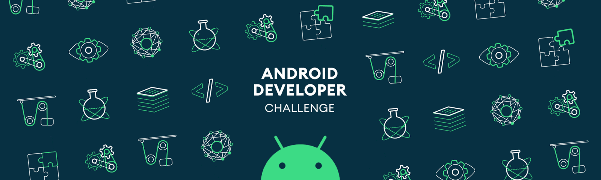

<h1 align="center">Phan Nhật Thắng</h1>

  <h2> 
    
      I am a developer mobile 
    
  </h2>

 

 

 

 

<picture>
  <source media="(prefers-color-scheme: dark)" srcset="https://raw.githubusercontent.com/holic-x/holic-x/output/github-contribution-grid-snake-dark.svg">
  <source media="(prefers-color-scheme: light)" srcset="https://raw.githubusercontent.com/holic-x/holic-x/output/github-contribution-grid-snake.svg">
  
</picture>

 

<h3 align="left">Languages and Tools:</h3>

 
   
   
  
   

  
  
   
  
   
  
   
   
  
  
  
   
   

